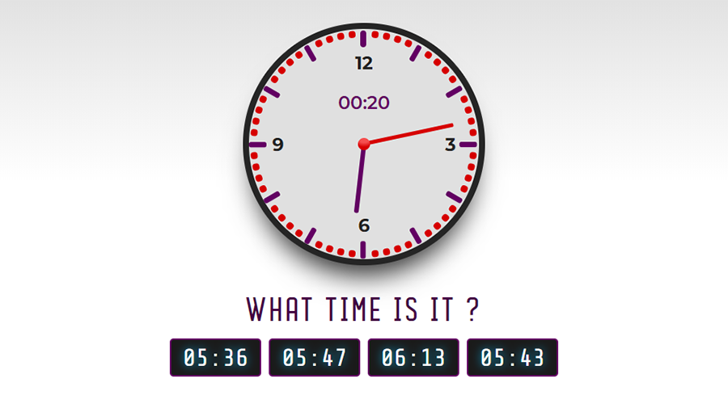

# Time Game

### Link:
[https://szymtur.github.io/time-game](https://szymtur.github.io/time-game)

### Description:
In this interactive quiz, kids practice identifying analog and digital clocks with specific times.
Kids must match digital clock to the analog clock that shows the same time. 
Perfect for practicing what the big hand and the little hand on a clock represent. 

### Technologies used:
- HTML5
- CSS3
- FlexBox
- RWD Media Queries
- JavaScript
- React.js

### Tools used:
- Webpack
